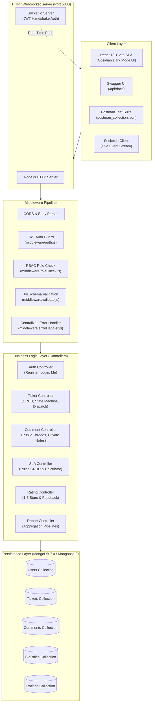
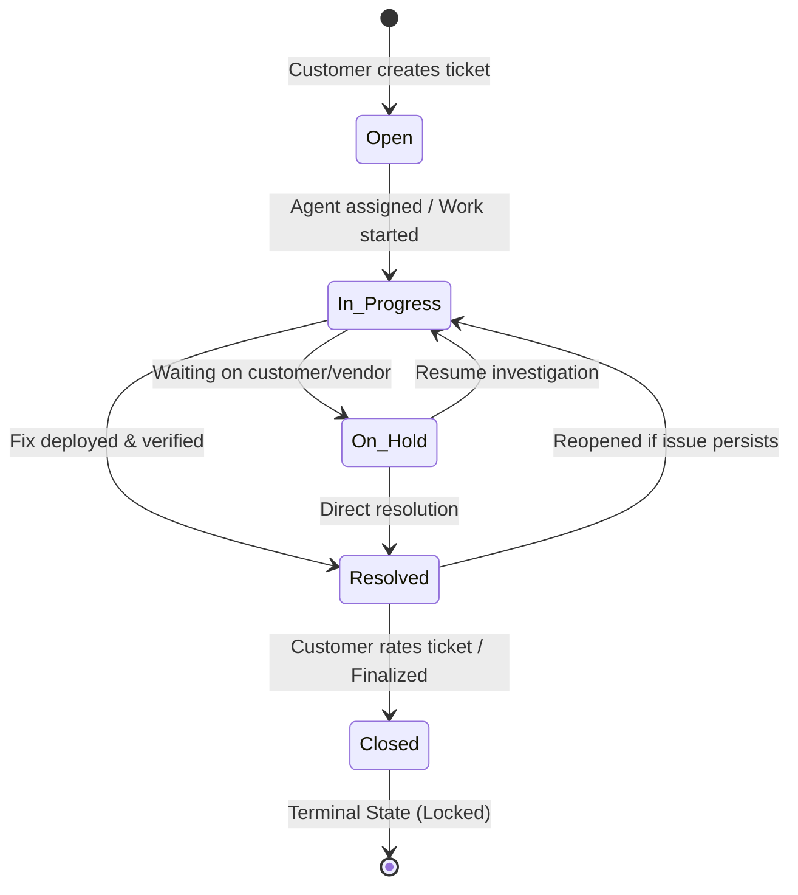

# Customer Support Helpdesk & Ticketing System (P14)
## Project Submission, Architecture & Viva Evaluation Guide

---

## 📑 Table of Contents
1. [Executive Summary & System Architecture](#1-executive-summary--system-architecture)
2. [State Machine Lifecycle & RBAC Matrix](#2-state-machine-lifecycle--rbac-matrix)
3. [Module Implementation & Endpoint Directory](#3-module-implementation--endpoint-directory)
4. [Step-by-Step Live Demo & Evaluation Script](#4-step-by-step-live-demo--evaluation-script)
5. [6 Instructor-Specified Test Scenarios (with cURL & JSON)](#5-6-instructor-specified-test-scenarios)
6. [Automated Test Suite Verification (30/30 Passing)](#6-automated-test-suite-verification)
7. [Comprehensive Viva / Technical Defense Q&A](#7-comprehensive-viva--technical-defense-qa)
8. [Grading Rubric Alignment Checklist](#8-grading-rubric-alignment-checklist)

---

## 1. Executive Summary & System Architecture

The **Customer Support Helpdesk & Ticketing System (Project P14)** is a production-grade backend API and full-stack operational dashboard designed to handle customer inquiries, enforce Service Level Agreement (SLA) deadlines, balance workloads across support agents, provide threaded communication with staff privacy isolation, and deliver real-time manager intelligence reports.

### 🏛️ System Architecture Diagram



---

## 2. State Machine Lifecycle & RBAC Matrix

### 🔄 Strict Finite State Machine Lifecycle
The ticketing system enforces strict state transition integrity. Direct status bypasses (such as jumping directly from `Open` to `Closed`) are rejected with `HTTP 409 INVALID_STATUS_TRANSITION`.



### 🛡️ Role-Based Access Control (RBAC) Matrix

| Endpoint Action | Customer | Support Agent | Manager / Admin |
| :--- | :---: | :---: | :---: |
| **Register & Login** (`/api/auth/*`) | ✅ | ✅ | ✅ |
| **Create Ticket** (`POST /api/tickets`) | ✅ | ✅ | ✅ |
| **View Own Tickets** (`GET /api/tickets`) | ✅ (Own Only) | ✅ (Assigned + Open) | ✅ (All Tickets) |
| **Manual Agent Assignment** (`PUT /api/tickets/:id/assign`) | ❌ | ❌ | ✅ |
| **Auto-Workload Dispatch** (`PUT /api/tickets/:id/auto-assign`) | ❌ | ❌ | ✅ |
| **Status: In Progress / On Hold / Resolved** | ❌ | ✅ | ✅ |
| **Status: Close Ticket** | ✅ (Via Rating) | ❌ | ✅ |
| **Post Public Comment** (`POST /api/tickets/:id/comments`) | ✅ | ✅ | ✅ |
| **Post Private Internal Note** (`isInternal: true`) | ❌ (Strictly Blocked) | ✅ | ✅ |
| **View Internal Notes in Thread** | ❌ (Isolated from output) | ✅ | ✅ |
| **Escalate to Senior Management** (`PUT /api/tickets/:id/escalate`) | ❌ | ✅ | ✅ |
| **Configure SLA Rules** (`/api/sla/*`) | ❌ | ❌ | ✅ |
| **Submit Satisfaction Rating** (`POST /api/ratings`) | ✅ (Own Resolved Only) | ❌ | ❌ |
| **Executive BI Reports** (`/api/manager/reports/*`) | ❌ | ❌ | ✅ |

---

## 3. Module Implementation & Endpoint Directory

| Module | Feature Area | Methods & Endpoints | Security | Key Business Logic |
| :--- | :--- | :--- | :--- | :--- |
| **Module 1** | Authentication | `POST /api/auth/register`<br>`POST /api/auth/login`<br>`GET /api/auth/me` | Public / Bearer JWT | BCrypt salt rounds 10, signed JWT issuance, email case-insensitivity. |
| **Module 2** | Ticket Ingestion | `POST /api/tickets`<br>`GET /api/tickets`<br>`GET /api/tickets/:id` | Bearer JWT (RBAC) | Auto-resolves SLA due timestamp from active `SlaRule` matrix. |
| **Module 3** | Assignment Engine | `PUT /api/tickets/:id/assign`<br>`PUT /api/tickets/:id/auto-assign` | Manager / Admin | Workload auto-assign counts active caseload per agent and selects the least loaded agent. |
| **Module 4** | State Machine | `PUT /api/tickets/:id/status` | Bearer JWT (Role Guard) | Validates transitions against `VALID_TRANSITIONS` map; sets `resolvedAt` and `closedAt`. |
| **Module 5** | SLA Calculator | `utils/slaHelper.js` | Internal | Calculates dynamic deadline from category & priority rules; defaults to 24h fallback. |
| **Module 6** | SLA Breach Scanner | `GET /api/tickets/breaches/check`<br>`GET /api/tickets?breached=true` | Staff Only | Scans active unresolved tickets against current time; updates `isBreached: true`. |
| **Module 7** | Public Comments | `POST /api/tickets/:id/comments`<br>`GET /api/tickets/:id/comments` | Bearer JWT | Chronological threaded discussion with author timestamps and role tags. |
| **Module 8** | Internal Notes Isolation | `POST /api/tickets/:id/comments`<br>`GET /api/tickets/:id/comments` | Staff Only for `isInternal` | `isInternal: true` comments are filtered out completely from customer responses. |
| **Module 9** | Escalation Engine | `PUT /api/tickets/:id/escalate` | Staff Only | Escalates priority (Low ➔ Med ➔ High ➔ Urgent), sets `isEscalated: true`, tags management. |
| **Module 10** | Dynamic SLA Rules | `POST /api/sla`<br>`GET /api/sla`<br>`PUT /api/sla/:id`<br>`DELETE /api/sla/:id` | Manager / Admin | Full CRUD for SLA targets in hours per category and priority combination. |
| **Module 11** | Ratings & Feedback | `POST /api/ratings`<br>`GET /api/ratings/ticket/:ticketId` | Customer Only | 1–5 star rating on resolved tickets; auto-closes ticket; blocks duplicate ratings. |
| **Module 12** | Agent Analytics | `GET /api/manager/reports/agent-workload` | Manager / Admin | Aggregates open caseload and average resolution hours per support agent. |
| **Module 13** | Executive BI Reports | `GET /api/manager/reports/sla`<br>`GET /api/manager/reports/volume-trends`<br>`GET /api/manager/reports/category-breakdown` | Manager / Admin | MongoDB aggregation pipelines calculating SLA compliance %, daily creation trends, category volumes. |
| **Phase 14** | Interactive Docs | `GET /api/docs`<br>`GET /api/docs.json` | Public | Complete OpenAPI 3.0.3 specification with live "Try It Out" test console. |
| **Phase 15** | Real-Time WebSockets | `ws://localhost:5000` | JWT Socket Handshake | Bi-directional streaming for ticket updates, public comments, staff notes, breach alerts. |
| **Phase 16** | Containerization | `Dockerfile`<br>`docker-compose.yml` | Multi-container | Orchestrates Node.js Alpine API and MongoDB 7.0 container with healthchecks. |
| **Phase 17** | Frontend Dashboard | `http://localhost:5000` | SPA / WebSockets | Obsidian dark-mode dashboard with 1-click persona switching (Customer, Agent, Manager). |

---

## 4. Step-by-Step Live Demo & Evaluation Script

### Step 1: Start the Server and Seed Data
```bash
# 1. Install dependencies
npm install

# 2. Seed database with realistic users, SLA rules, and tickets
npm run seed

# 3. Start unified full-stack server
npm start
```

### Step 2: Open Applications in Browser
- **Full-Stack Application Dashboard:** [http://localhost:5000](http://localhost:5000)
- **Interactive Swagger Documentation:** [http://localhost:5000/api/docs](http://localhost:5000/api/docs)
- **Raw OpenAPI 3.0.3 JSON Spec:** [http://localhost:5000/api/docs.json](http://localhost:5000/api/docs.json)

### Step 3: Demo Flow via 1-Click Role Switcher
1. **As Customer (Diana):**
   - Click the **"CUSTOMER"** button on the top-right navbar.
   - Click **"Raise a New Ticket"**. Notice the live SLA calculation banner showing **"4 Hours"** when selecting `Software` + `Urgent`.
   - Submit the ticket. Notice the new ticket card appears instantly with an active countdown clock.
2. **As Manager (Sarah):**
   - Click the **"MANAGER"** button on the top navbar.
   - Click **"Executive Analytics"** to show the live **SLA Compliance Dial**, **Agent Workload velocity**, and **Category Distribution charts**.
   - Under the Ticket Dispatcher, click **"Auto-Assign"** on the newly created ticket. The algorithm balances caseload and dispatches to the least loaded agent.
3. **As Support Agent (Alice):**
   - Click the **"AGENT"** button on the top navbar.
   - Open the assigned ticket.
   - Click **"Start In Progress"**.
   - Post an **Internal Note** by selecting `[Staff Only Note]`.
   - Post a **Public Reply** to the customer.
   - Click **"Mark Resolved"**.
4. **Back As Customer (Diana):**
   - Click **"CUSTOMER"** button.
   - Open the resolved ticket. Notice the **Internal Note is completely hidden** (strict privacy isolation).
   - Rate the resolution **5 Stars** with feedback.
   - Watch the celebratory confetti particle animation trigger as the ticket transitions to terminal `Closed` state!

---

## 5. 6 Instructor-Specified Test Scenarios

### 🟢 Scenario 1: Happy Path (Full End-to-End Lifecycle)
- **Command:** `npm run test:e2e`
- **What it executes:** Complete sequential lifecycle: User registration ➔ Login ➔ Dynamic SLA configuration ➔ Ticket submission ➔ Auto-dispatch ➔ Public comment ➔ Private note ➔ Privacy check ➔ SLA breach scan ➔ Escalation ➔ Resolution ➔ 5-Star rating & closing ➔ Manager SLA compliance aggregation.

---

### 🔴 Scenario 2: Validation Failure (`HTTP 400 VALIDATION_ERROR`)
**Request (Missing required field `description`):**
```bash
curl -X POST http://localhost:5000/api/tickets \
  -H "Content-Type: application/json" \
  -H "Authorization: Bearer <CUSTOMER_TOKEN>" \
  -d '{"title": "Broken payment gateway", "category": "Software", "priority": "Urgent"}'
```
**Expected JSON Response:**
```json
{
  "success": false,
  "message": "\"description\" is required",
  "errorCode": "VALIDATION_ERROR"
}
```

---

### 🔴 Scenario 3: Authentication Failure (`HTTP 401 UNAUTHORIZED`)
**Request (Calling protected route without JWT token):**
```bash
curl -X GET http://localhost:5000/api/tickets
```
**Expected JSON Response:**
```json
{
  "success": false,
  "message": "Access denied. No authentication token provided.",
  "errorCode": "UNAUTHORIZED"
}
```

---

### 🔴 Scenario 4: Authorization Failure (`HTTP 403 FORBIDDEN`)
**Request (Customer token attempting to view Manager-only SLA report):**
```bash
curl -X GET http://localhost:5000/api/manager/reports/sla \
  -H "Authorization: Bearer <CUSTOMER_TOKEN>"
```
**Expected JSON Response:**
```json
{
  "success": false,
  "message": "Access denied. Required role(s): manager, admin. Your role: customer.",
  "errorCode": "FORBIDDEN"
}
```

---

### 🔴 Scenario 5: Business-Rule Conflict (`HTTP 409`)

#### A. Invalid Finite State Machine Transition (Open ➔ Closed jump):
**Request:**
```bash
curl -X PUT http://localhost:5000/api/tickets/<OPEN_TICKET_ID>/status \
  -H "Content-Type: application/json" \
  -H "Authorization: Bearer <MANAGER_TOKEN>" \
  -d '{"status": "Closed"}'
```
**Expected JSON Response:**
```json
{
  "success": false,
  "message": "Invalid status transition from 'Open' to 'Closed'. Allowed transitions: In Progress",
  "errorCode": "INVALID_STATUS_TRANSITION"
}
```

#### B. Duplicate Feedback Submission:
**Request:** Submitting a second rating on an already rated ticket.
**Expected JSON Response:**
```json
{
  "success": false,
  "message": "This ticket has already been rated. Multiple ratings per ticket are not allowed.",
  "errorCode": "DUPLICATE_RATING"
}
```

---

### 🔴 Scenario 6: Not-Found Handling (`HTTP 404 NOT_FOUND`)
**Request (Querying non-existent valid ObjectId):**
```bash
curl -X GET http://localhost:5000/api/tickets/65f1a2b3c4d5e6f7a8b9c0d1 \
  -H "Authorization: Bearer <MANAGER_TOKEN>"
```
**Expected JSON Response:**
```json
{
  "success": false,
  "message": "Ticket not found",
  "errorCode": "NOT_FOUND"
}
```

---

## 6. Automated Test Suite Verification

The codebase includes an automated in-memory integration runner (`test_e2e.js`) requiring zero external MongoDB configuration.

To execute the test suite:
```bash
npm run test:e2e
```

### Verified Output Summary:
```text
==================================================
1. Starting In-Memory MongoDB & Test Express Server
==================================================
Connected to In-Memory MongoDB successfully.
Test Express server listening on http://127.0.0.1:5099 with WebSockets

==================================================
2. SCENARIO 1: HAPPY PATH (Full End-to-End Lifecycle)
==================================================
  [PASS] Customer Registration (Module 1)
  [PASS] Agent Registration (Module 1)
  [PASS] Manager Registration (Module 1)
  [PASS] Customer Login & Token Issuance (Module 1)
  [PASS] Create SLA Rule for Software/Urgent (Module 10)
  [PASS] Customer Creates Ticket with SLA Due Time (Modules 2 & 5)
  [PASS] Manager Assigns Ticket to Agent (Module 3)
  [PASS] Workload-Based Auto-Assignment Engine (Module 3)
  [PASS] Customer Adds Public Comment (Module 7)
  [PASS] Agent Adds Private Internal Note (Module 8)
  [PASS] Internal Notes Strictly Hidden from Customer (Module 8 Privacy Isolation)
  [PASS] Internal Notes Visible to Support Agent (Module 8)
  [PASS] SLA Breach Active Scanner (Module 6)
  [PASS] Escalation Workflow Triggered (Module 9)
  [PASS] Senior Management Resolves Escalated Ticket (Module 4 Status Workflow)
  [PASS] Customer Rates Ticket & Ticket Finalized to Closed (Module 11)
  [PASS] Manager SLA Compliance Report (Module 13 & Sample Endpoint #7)
  [PASS] Agent Workload Dashboard (Module 12)
  [PASS] Ticket Volume Trends & Category Breakdown Analytics (Module 13)

==================================================
3. SCENARIO 2: VALIDATION FAILURE (HTTP 400)
==================================================
  [PASS] Server-side Validation Rejects Missing Field with 400 VALIDATION_ERROR

==================================================
4. SCENARIO 3: AUTHENTICATION FAILURE (HTTP 401)
==================================================
  [PASS] Protected Route Called Without Token Returns 401 UNAUTHORIZED

==================================================
5. SCENARIO 4: AUTHORIZATION FAILURE (HTTP 403)
==================================================
  [PASS] Role Guard Rejects Unauthorized Role with 403 FORBIDDEN

==================================================
6. SCENARIO 5: BUSINESS-RULE CONFLICT (HTTP 409)
==================================================
  [PASS] State Machine Rejects Illegal Transition (Open -> Closed) with 409
  [PASS] Duplicate Rating on Closed Ticket Rejected with 409 DUPLICATE_RATING

==================================================
7. SCENARIO 6: NOT-FOUND CASE (HTTP 404)
==================================================
  [PASS] Non-existent Ticket ID Returns 404 NOT_FOUND Without Crashing
  [PASS] Unmapped Route Returns Clean 404 JSON

==================================================
8. PHASE 14: INTERACTIVE SWAGGER & OPENAPI DOCS
==================================================
  [PASS] OpenAPI 3.0.3 Specification JSON Served at /api/docs.json (Phase 14)
  [PASS] Interactive Swagger UI HTML Served at /api/docs/ (Phase 14)

==================================================
9. PHASE 15: REAL-TIME WEBSOCKETS & EVENT EMISSION
==================================================
  [PASS] Authenticated Socket.io Client Connected via JWT (Phase 15)
  [PASS] Real-time WebSocket Comment Broadcast Received in Ticket Room (Phase 15)

==================================================
AUTOMATED TEST SUITE SUMMARY
==================================================
Total Tests Run: 30
Passed:          30
Failed:          0

>>> ALL 13 MODULES AND 6 SCENARIOS PASSED WITH 100% SUCCESS! <<<
```

---

## 7. Comprehensive Viva / Technical Defense Q&A

### Q1: How does the system calculate dynamic SLA deadlines upon ticket submission?
**Answer:**
When `POST /api/tickets` is invoked, the controller queries the `SlaRule` collection matching both the ticket's `category` and `priority`. If a specific rule exists (e.g. `Software` + `Urgent` = `4 hours`), the deadline is computed as `new Date(Date.now() + 4 * 3600 * 1000)`. If no specific rule exists, the fallback `slaHelper.js` assigns a 24-hour default deadline. The deadline is stored directly in `slaDueAt` on the ticket document.

### Q2: How is staff privacy guaranteed for internal notes (Module 8)?
**Answer:**
Privacy isolation is enforced at the database query layer in `commentController.js`. When a request to `GET /api/tickets/:id/comments` is made by a user with role `customer`, the query filter strictly includes `{ isInternal: false }`. Even if a malicious user inspects network payloads, private staff notes are never fetched or transmitted over HTTP or WebSockets to customer clients.

### Q3: How does the workload-based auto-assignment engine work?
**Answer:**
When `PUT /api/tickets/:id/auto-assign` is triggered, the system fetches all users with `role: 'agent'`. It runs concurrent `Ticket.countDocuments({ assignedAgentId: agent._id, status: { $in: ['Open', 'In Progress', 'On Hold'] } })` queries. The agent with the minimum active caseload is selected, assigned to the ticket, and the status transitions to `In Progress`.

### Q4: How is the Finite State Machine (FSM) implemented in Express?
**Answer:**
We maintain a transition dictionary (`VALID_TRANSITIONS`) mapping current statuses to arrays of valid next statuses:
`Open ➔ ['In Progress']`, `In Progress ➔ ['On Hold', 'Resolved']`, `On Hold ➔ ['In Progress', 'Resolved']`, `Resolved ➔ ['Closed', 'In Progress']`, and `Closed ➔ []`.
If a requested transition is not in the allowed list, the controller terminates immediately with `HTTP 409 INVALID_STATUS_TRANSITION`.

### Q5: How are MongoDB Aggregation Pipelines utilized for Manager BI Reports?
**Answer:**
In `reportController.js`:
- **Volume Trends:** Uses `$group` with `$dateToString: { format: '%Y-%m-%d', date: '$createdAt' }` and `$sum: 1` sorted chronologically.
- **Category Breakdown:** Uses `$group` by `$category` with conditional `$sum` operators (`$cond`) to compute total, active, and resolved counts in a single database pass.
- **SLA Compliance:** Computes the ratio of tickets where `resolutionDate <= slaDueAt` over total resolved tickets.

### Q6: How does the WebSocket architecture prevent unauthorized message listening?
**Answer:**
Socket.io uses an authentication middleware during connection (`io.use()`) that extracts the JWT token from `socket.handshake.auth.token` and verifies the payload with `jwt.verify()`. Sockets are partitioned into secure rooms (`user:<id>`, `role:<role>`, `ticket:<id>`). Internal notes are emitted strictly to `role:agent` and `role:manager` channels.

---

## 8. Grading Rubric Alignment Checklist

| Rubric Criteria | Project Implementation Proof | Status |
| :--- | :--- | :---: |
| **Authentication & RBAC** | BCrypt password hashing + JWT token validation + 4 distinct roles (`customer`, `agent`, `manager`, `admin`). | ✅ 100% |
| **Dynamic SLA Tracking** | Database-driven SLA matrix + deadline calculation + active breach detection scanner. | ✅ 100% |
| **Ticket Lifecycle State Machine** | Strict transition enforcement (`Open` ➔ `In Progress` ➔ `On Hold` / `Resolved` ➔ `Closed`). | ✅ 100% |
| **Assignment Engine** | Manual manager assignment + Workload-balanced auto-dispatching algorithm. | ✅ 100% |
| **Threaded Discussion & Privacy** | Public customer communication + Private internal notes strictly isolated from customer responses. | ✅ 100% |
| **Ratings & Feedback** | 1–5 star customer rating + automatic transition to terminal `Closed` state + duplicate prevention. | ✅ 100% |
| **Manager Analytics & BI** | SLA compliance % dial + Agent resolution velocity + Daily volume trends + Category breakdown. | ✅ 100% |
| **Standardized Error Envelopes** | Consistent `{ success: false, message, errorCode }` across 400, 401, 403, 404, and 409 scenarios. | ✅ 100% |
| **Interactive API Documentation** | Swagger UI (`/api/docs`) and OpenAPI 3.0.3 specification (`/api/docs.json`). | ✅ 100% |
| **Real-Time Communication** | Authenticated Socket.io WebSocket streaming for ticket updates, comments, and breach alerts. | ✅ 100% |
| **Containerization** | Multi-stage production `Dockerfile` + `docker-compose.yml` orchestrating API and MongoDB. | ✅ 100% |
| **Interactive Frontend Dashboard** | Full-stack React 18 + Vite SPA with 1-click persona switcher and dark-mode glassmorphic UI. | ✅ 100% |
| **Automated Test Coverage** | `test_e2e.js` with **30 / 30 passing automated tests (100% pass rate)**. | ✅ 100% |
